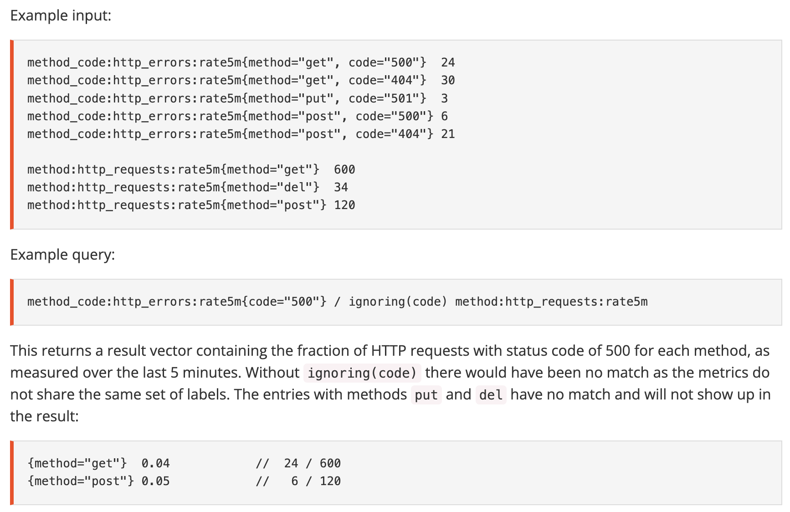
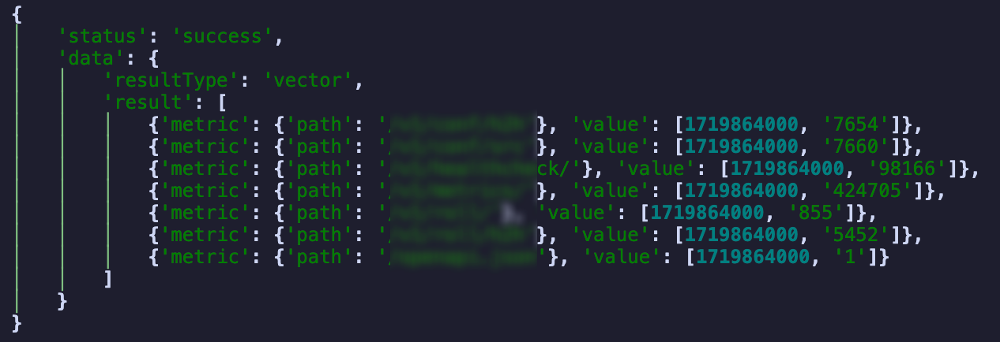
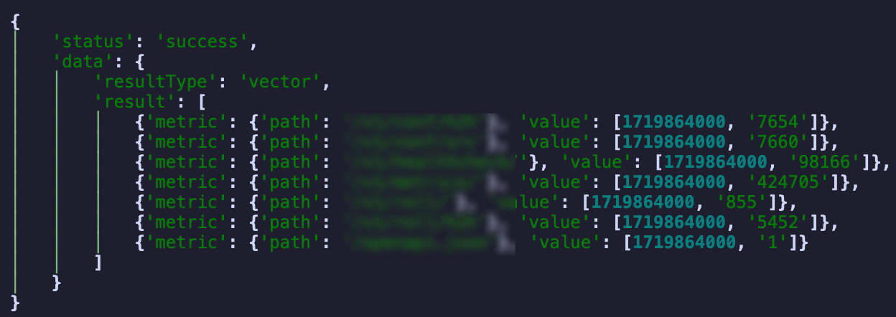
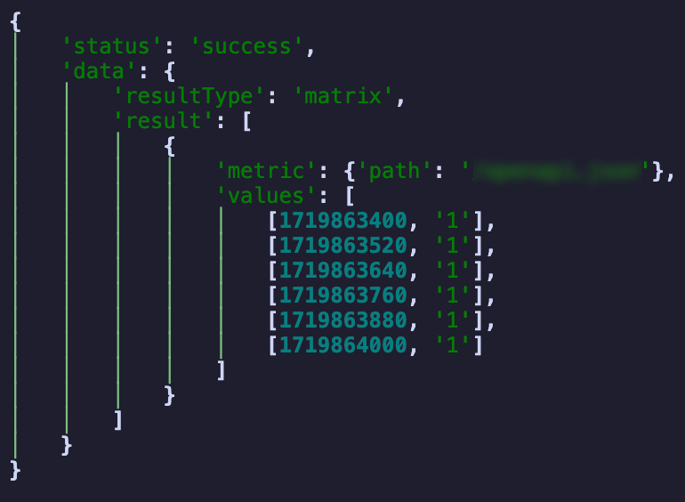
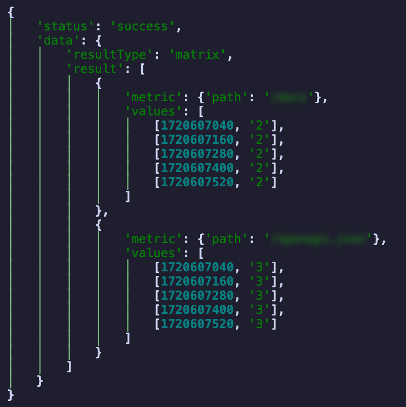
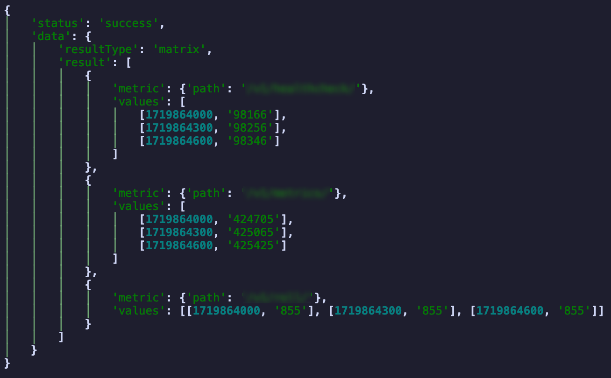
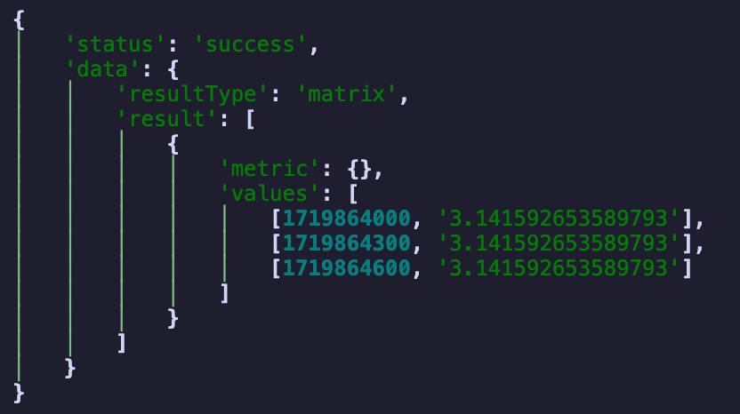

# Prometheus

[Prometheus](https://prometheus.io/) 采集系统指标 (metrics)，并将其存储为时间序列 (time series)；并提供了一套强大的查询语言 PromQL，用于查询和分析这些指标。通常，我们会使用 Grafana 来把这些指标可视化。

本文主要介绍 Prometheus 的基本概念和查询方法。

<!-- more -->

!!! info
    如果暂时从未实际接触过 Prometheus，您可以在 [这里](https://grafana.com/blog/2019/12/04/how-to-explore-prometheus-with-easy-hello-world-projects/) 找到一个 minimum 的 end-to-end 示例。

## 1 Concepts | 基本概念

### 1.1 Data Model | 数据模型

Prometheus 存储的内容是一系列 `(metric_name, labels, timestamp, value)`；其中：

- `metric_name` 是指标名，用于表明指标的含义 (e.g. `http_requests_total`)；
- `labels` 是可选的，包含一组任意键值对，用于区分指标的不同维度 (e.g. `method="GET"`)；
    - 例如 `http_requests_total{method="GET", status="200"}` 表示 `GET` 请求返回 `200` 的总次数；
- `(timestamp, value)` 被合并称为 `sample`，表示在某个时间点下 `metric_name{labels}` 的值。
    - `timestamp` 的精度是毫秒，`value` 是一个 float64 数值。

### 1.2 Prometheus 如何采集指标

常见语言都有 Prometheus 的 client library，用于在应用程序中采集指标并暴露出来。例如，服务可以在 `/metrics` 路径下暴露指标，指标可能形如：

```hl_lines="11-15"
# HELP python_gc_objects_collected_total Objects collected during gc
# TYPE python_gc_objects_collected_total counter
python_gc_objects_collected_total{generation="0"} 4.6086284e+07
python_gc_objects_collected_total{generation="1"} 2.1484146e+07
python_gc_objects_collected_total{generation="2"} 6.290886e+06
# HELP python_gc_objects_uncollectable_total Uncollectable objects found during GC
# TYPE python_gc_objects_uncollectable_total counter
python_gc_objects_uncollectable_total{generation="0"} 0.0
python_gc_objects_uncollectable_total{generation="1"} 0.0
python_gc_objects_uncollectable_total{generation="2"} 0.0
# HELP http_requests_total Total number of HTTP requests
# TYPE http_requests_total counter
http_requests_total{method="post",code="200"} 1027.0
http_requests_total{method="post",code="400"} 3.0
http_requests_total{method="get",code="200"} 10000.0
```

在服务中，每次接受到 http 请求时，会根据请求的 method 和 code 修改一次 `http_requests_total` 指标。Prometheus 每隔指定的一段时间会去 `/metrics` 拉取这些指标，获得上面代码块所示的数据，从而获取到 `(metric_name, labels, timestamp, value)` 的 data model。

!!! note
    在 Prometheus 看来，一个 `metric_name{labels}` 的值是一个时间序列，即一系列 `(timestamp, value)` 的集合。如果 `labels` 的取值发生变化，Prometheus 会认为这是一个新的时间序列。

另外，在每次抓取数据时，Prometheus 还会额外记录以下指标：

- `up`，1 表示抓取成功，0 表示失败；这对于检查实例是否可用非常有用；
- `scrape_duration_seconds`，抓取数据的耗时；
- 还有更多，参见 [Automatically generated labels and time series](https://prometheus.io/docs/concepts/jobs_instances/#automatically-generated-labels-and-time-series)。

!!! info
    有时，需要被监控的组件可能不支持被 Prometheus 直接抓取，此时可以在组件中 [主动 Push](https://prometheus.io/docs/instrumenting/pushing/)；但这不会被包含在本文的内容中。。

### 1.3 Metric Types | 指标类型

Prometheus 的 client library 支持以下 4 种指标类型；但这只是一个便于使用的封装，在 Prometheus 中的指标仍然只有 `(metric_name, labels, timestamp, value)`

- `Counter`：只增不减的计数器。在 client 中，支持 `c.inc()` 或 `c.inc(1.6)` 的操作来增加其值。
- `Gauge`：可增可减的值。在 client 中，支持 `g.set(3.2)`, `g.inc()` 或 `g.dec(10)` 的操作来修改其值。
- `Histogram`：对观察的结果进行采样，记录到预先指定好的若干范围 (bucket) 中，用于统计数据的分布情况。在 client 中，支持 `h.observe(3.2)` 的操作来记录数据。参见下面的例子。
- `Summary`：对观察的结果进行采样，记录到预先指定好的若干分位数 (quantile) 中，用于统计数据的分布情况。在 client 中，支持 `s.observe(3.2)` 的操作来记录数据。参见下面的例子。

!!! warning
    请注意：并非所有的 client library 都支持所有的指标类型。例如，[截至目前](https://github.com/prometheus/client_python/issues/888) Python 的 client library `prometheus_client` 不支持 `Summary` 的 quantile 配置。

??? example "Histogram"
    `Histogram` 会将观察到的数据分桶 (bucket)，然后记录每个分桶的数据量。在创建一个 `Histogram` 指标时，需要指定各个 bucket 的上限值；`Histogram` 实际上会创建一系列不同的 metric 来记录观察得到的数据。下面是一个例子。

    举例而言，我们使用名为 `http_request_duration_seconds` 的 histogram 指标来记录请求的响应时间；它包含 `api` 和 `method` 两个 label；我们定义了如下的几个 bucket: `(0.1, 0.5, 1.0, Inf)`。那么，假如有 `#!python http_request_duration_seconds(api="/foo", method="GET").observe(0.8)`，那么 client 会记录如下的数据：

    ```linenums="1"
    http_request_duration_seconds_bucket{le="0.1",api="/foo",method="GET"} 0
    http_request_duration_seconds_bucket{le="0.5",api="/foo",method="GET"} 0
    http_request_duration_seconds_bucket{le="1.0",api="/foo",method="GET"} 1
    http_request_duration_seconds_bucket{le="+Inf",api="/foo",method="GET"} 1

    http_request_duration_seconds_sum{api="/foo",method="GET"} 0.8

    http_request_duration_seconds_count{api="/foo",method="GET"} 1
    ```

    1-4 行的几个 `<metricName>_bucket` 中记录了落到各个 bucket 的数据量；`le` (less than or equal to) 表示不大于该值的 observe 次数。第 6 行的 `<metricName>_sum` 记录了所有 observe 的数据和，第 8 行的 `<metricName>_count` 记录了 observe 的总量。

    在此基础上，如果有 `#!python http_request_duration_seconds(api="/foo", method="GET").observe(0.4)`，那么数据会变为：

    ```linenums="1"
    http_request_duration_seconds_bucket{le="0.1",api="/foo",method="GET"} 0
    http_request_duration_seconds_bucket{le="0.5",api="/foo",method="GET"} 1
    http_request_duration_seconds_bucket{le="1.0",api="/foo",method="GET"} 2
    http_request_duration_seconds_bucket{le="+Inf",api="/foo",method="GET"} 2

    http_request_duration_seconds_sum{api="/foo",method="GET"} 1.2

    http_request_duration_seconds_count{api="/foo",method="GET"} 2
    ```

    如果还有 `#!python http_request_duration_seconds(api="/bar", method="GET").observe(1.2)`，那么会新增与上述类似的 6 个 time series。

??? example "Summary"
    与 `Histogram` 类似，`Summary` 也会创建一系列不同的 metric 来记录观察得到的数据；但它会记录不同的分位数 (quantile) 而非预先定义的 bucket。例如：

    ```
    http_request_duration_seconds{quantile="0.5"} 0.232227334
    http_request_duration_seconds{quantile="0.90"} 0.821139321
    http_request_duration_seconds{quantile="0.95"} 1.528948804
    http_request_duration_seconds{quantile="0.99"} 2.829188272
    http_request_duration_seconds{quantile="1"} 34.283829292

    http_request_duration_seconds_sum 8953.332
    http_request_duration_seconds_count 27892
    ```

    由于 `Summary` 需要使用流式算法来计算分位数，因此它的计算量会比 `Histogram` 大得多。

关于如何选择 `Histogram` 和 `Summary`，请参考 [Histograms and Summaries | Prometheus](https://prometheus.io/docs/practices/histograms/)。

## 2 Querying | 查询

!!! note "Thanos"
    本文主要介绍 Prometheus；但在实际使用中，可能会使用 [Thanos](https://thanos.io/) 来扩展 Prometheus 的功能。Thanos 提供了一些额外的功能，例如长期存储、查询优化、数据压缩等。

    例如，每个集群的 Prometheus 负责收集所在集群各服务的 metrics 并提供一定的查询能力；而 Thanos 以 sidecar 的形式整合各个集群的 Prometheus 采集的指标并长期保存，**并同样适用 PromQL 查询**。

### 2.1 Data Types | 数据类型

在 PromQL 中，大多数表达式归属于以下 3 种类型之一：

- Scalar：单个浮点数数值；
- Instant vector：一组时间序列，每个时间序列包含它在查询时间点前最后一次被采样到的值。例如 Query `http_requests_total` 或者 `http_requests_total{method="GET"}` 返回在 query timestamp 这个时间点之前每个时间序列最后一次被采样到的值；
    - 请注意：即使 `http_requests_total{method="GET"}` 得到的 instant vector 只包含 1 个元素，它也不能被视为 scalar。
- Range vector：一组时间序列，每个时间序列包含它在查询时间段内每个时间点的值，例如 `http_requests_total[5m]` 返回在 5 分钟内每个时间序列的值。

如果我们用 Python 做类比的话，上面的三个类型可以以如下方式表示：

```Python linenums="1" hl_lines="1 7 12"
type Scalar = float

type Labels = Dict[str, str]
type Sample = Tuple[Timestamp, Scalar]

type LabeledSample = Tuple[Labels, Sample]
type InstantVector = List[LabeledSample]

type TimeStamp = int
type TimeSeries = List[Sample]
type LabeledTimeSeries = Tuple[Labels, TimeSeries]
type RangeVector = List[LabeledTimeSeries]
```

### 2.2 Time Series Selectors | 时间序列选择器

以下表达式具有类型 `InstantVector`：

- `http_requests_total`
- `http_requests_total{method="GET"}`
    - 对于没有被 matchers 提及的 label，则任何值全部接受。
    - 对于同一个 label，可以有多个 matchers，它们之间是 AND 关系。
- `{__name__="http_requests_total", method="GET"}`
    - `__name__` 是一个特殊的 label，用于匹配指标名。
    - 由此可见，**selector 中不必包含 metric_name**。
    - 因此，该表达式和前一个例子等价。
- `http_requests_total{api=~"v1.*", code!~"20[0-9]", method!="POST"}`
    - `=` 表示精确匹配，`=~` 表示正则匹配，`!=` 和 `!~` 表示不匹配，分别适用于字符串和正则表达式。
    - 正则表达式是 fully anchored 的，即 `api=~"v1.*"` 等价于 `api=~"^v1.*$"`。
- `http_requests_total offset 5m` / `http_requests_total{method="GET"} offset 5m`
    - `offset` 用于指定时间偏移量，例如 `offset 5m` 表示向前偏移 5 分钟。
- `http_requests_total @ 1609746000` / `http_requests_total{method="GET"} @ 1609746000`
    - `@` 用于指定时间戳，例如 `@ 1609746000` 表示在时间戳 1609746000 的时候的值。

!!! info "哪些 time series 会被包含在查询结果中？"
    Prometheus 配置了一个 [staleness](https://prometheus.io/docs/prometheus/latest/querying/basics/#staleness) 时长，默认值是 5 分钟。
    
    在使用 Instant Vector Selector 时，在查询时间点前 staleness 时长的范围内出现过数据的所有 time series 会被包含在结果的 `InstantVector` 中；其值是该范围内最后一次采样到的值。

以下表达式具有类型 `RangeVector`：

- `http_requests_total[5m]`
- `http_requests_total{method="GET"}[5m]`
- `http_requests_total{method="GET"}[5m] offset 5m`
- `http_requests_total{method="GET"}[5m] @ 1609746000`

!!! info "哪些 time series 会被包含在查询结果中？"
    对于 Range Vector Selector，Prometheus 会返回在查询时间内出现过数据的所有 time series；其值是在查询时间范围内每个时间点的值。

### 2.3 Operators | 运算符

#### 2.3.1 算术二元运算符

包括 `+`, `-`, `*`, `/`, `%` (取模), `^` (幂)。其行为是：

- `Scalar <op> Scalar`：和正常算术一致；
- `InstantVector <op> Scalar`：返回对 InstantVector 中的每个元素应用 `<op>` 的结果；**metric_name (`__name__`) 被删除**；
- `InstantVector1 <op> InstantVector2`：对于 InstantVector1 中的每个元素，在 InstantVector2 中找到标签完全相同的元素，将其应用 `<op>` 的结果返回，**metric_name (`__name__`) 被删除**；如果没找到，则结果中不包含该 label；
- 不接受 RangeVector。

#### 2.3.2 比较二元运算符

包括 `==`, `!=`, `>`, `<`, `>=`, `<=`。其行为是：

- `bool(Scalar <op> Scalar)`：返回 0 或者 1；
- `InstantVector <op> Scalar`：返回结果中比较结果为真的元素保留，其余删除；
- `bool(InstantVector <op> Scalar)`：返回结果中将比较结果为真的元素置为 1，其余置为 0；**metric_name (`__name__`) 被删除**；
- `InstantVector1 <op> InstantVector2`：InstantVector2 作为过滤器：InstantVector1 在其中找不到标签完全相同的元素，或者对应元素比较结果为假的，将其删除；
- `bool(InstantVector1 <op> InstantVector2)`：类似前一条：保留的元素置为 1，其余置为 0；**metric_name (`__name__`) 被删除**；
- 不接受 RangeVector。

#### 2.3.3 逻辑（集合）二元运算符

包括 `and`, `or`, `unless`，只在 `InstantVector` 之间定义。其行为是：

- `iv1 and iv2` (intersection)：返回 iv1 中的那些在 iv2 中具有完全相同标签的元素；
- `iv1 or iv2` (union)：返回 iv1 的所有元素，以及 iv2 中那些在 iv1 中没有完全相同标签集的元素；
- `iv1 unless iv2` (complement)：返回 iv1 中的那些在 iv2 中没有完全相同标签的元素。

#### 2.3.4 Vector Matching

上面三节中描述的 `InstantVector` 之间的操作，都试图从右边的 `InstantVector` 中为左边的 `InstantVector` 中的每个元素找到标签匹配的元素。这个「匹配」过程也是可以控制的：

- `iv1 <bin-op> on(<label-list>) iv2` 将纳入考虑的标签限制在 `<label-list>` 中，其他标签全部忽略；
- `iv1 <bin-op> ignoring(<label-list>) iv2` 将忽略 `<label-list>` 中的标签，其他标签全部纳入考虑。

下图展示了一个例子：



另外在算术和比较运算符中，还可以通过 `group_left` 和 `group_right` 实现一对多和多对一的匹配。本文暂且略去，参见 [文档](https://prometheus.io/docs/prometheus/latest/querying/operators/#many-to-one-and-one-to-many-vector-matches)。

#### 2.3.5 聚合运算符

!!! note
    除了 `topk` 和 `bottomk` 以外，所有聚合运算符都会在结果中删除 metrics name (`__name__`)，因为所得的值经过了处理，而原来 metrics name 不再有意义。

聚合运算符将 InstantVector 按照标签聚合为元素更少的 InstantVector。例如：

- `sum(http_requests_total)`：返回一个单元素的 InstantVector，标签为 `{}`，值为所有 `http_requests_total` 的和；
- `sum(http_requests_total{method="GET"})`：返回一个单元素的 InstantVector，标签为 `{}`，值为所有 `http_requests_total{method="GET"}` 的和；
- `sum(http_requests_total) by (method)`：返回一个 InstantVector；对于 `http_requests_total` 中的每个不同的 `method`，返回一个元素，标签只有 `method`，值为所有对应 method 的 `http_requests_total` 的和；
- `sum(http_requests_total) by (method, code)`：类似，对于 `(method, code)` 的每种存在的组合，返回一个元素。
- `sum(http_requests_total) without (method)`：与 `by` 相反：对于除了 `method` 以外的所有标签的每种存在组合，返回一个元素。
    - 例如，标签只有 `method, code, api` 的话，那么 `by (method)` 和 `without (code, api)` 等价。

以上的 `without` 和 `by` 不能共用；另外 `sum(v) by (<labels>)` 和 `sum by (<labels>) (v)` 是等价的。

即：我们通过 `by` 或者 `without` 将 InstantVector 按照标签 **分组**，然后完成聚合操作；如果没有指定分组，则认为所有标签属于一组。这样的聚合运算符包括：

- `sum`: 每组中所有元素的和；
- `max`, `min`, `avg`, `stddev`, `stdvar`: 分别是最大值、最小值、平均值、标准差、方差；
- `group`: 结果中的值全部为 1；
- `count`: 每组中元素的个数。

另外，还有一些聚合函数含有参数，其使用方法形如 `count_values("api", http_requests_total) by (code)`，表示对于每个 `code`，统计 label `api` 的不同值的个数。这样的聚合运算符包括：

- `count_values(label, v)`: 对于每个组，统计 label 的不同值的个数；
- `quantile(φ, v)`: 对于每个组，计算其中所有值中 φ 分位的值。

与上述不同的两个聚合运算符是 `topk` 和 `bottomk`，它们保留每组中的前 k 个或后 k 个元素。


### 2.4 Functions | 函数

!!! note
    请注意：几乎所有的函数 (除了 `sort`, `sort_desc`, `label_replace`) 都会在结果中删除 metrics name (`__name__`)，因为所得的值经过了处理，而原来 metrics name 不再有意义。

下面，我们使用 `IV` 和 `RV` 分别替代 `InstantVector` 和 `RangeVector`。

#### 数学运算

- 【绝对值】`abs(v: IV) -> IV`: 结果中每个元素的值是原来元素的绝对值。
- 【符号函数】`sgn(v: IV) -> IV`: 结果中每个元素的值是原来元素的正负性，即 1、0、-1。
- 【向上取整】`ceil(v: IV) -> IV`: 结果中每个元素的值是原来元素的向上取整。
- 【向下取整】`floor(v: IV) -> IV`: 结果中每个元素的值是原来元素的向下取整。
- 【四舍五入】`round(v: IV, to_nearest: Scalar = 1) -> IV`: 结果中每个元素的值是原来元素的四舍五入值，取到最接近的 `to_nearest` 的倍数；`to_nearest` 可以是分数。
- 【指数】`exp(v: IV) -> IV`: 结果中每个元素的值是原来元素的指数 $e^x$。
- 【自然对数】`ln(v: IV) -> IV`: 结果中每个元素的值是原来元素的自然对数 $\ln(x)$。
- 【对数】`log2(v: IV) -> IV`, `log10(v: IV) -> IV`: 结果中每个元素的值是原来元素的对数。
- 【平方根】`sqrt(v: IV) -> IV`: 结果中每个元素的值是原来元素的平方根。
- 【三角函数】另外还有这些三角函数，和上述类似：`sin`, `cos`, `tan`, `asin`, `acos`, `atan`, `sinh`, `cosh`, `tanh`, `asinh`, `acosh`, `atanh`。
- 【角度和弧度】`deg(v: IV) -> IV`, `rad(v: IV) -> IV`: 将角度和弧度相互转换。
- 【$\pi$】`pi() -> Scalar` 返回 $\pi$。

#### 时间

- 【求值时的时间】`time() -> Scalar`: 返回计算表达式时的时间戳，即自 UTC 1970 年 1 月 1 日以来的秒数。
- 【时间戳】`timestamp(v: IV) -> IV`: 返回 v 中每个时间序列的时间戳。
- `day_of_month(v: IV = vector(time())) -> IV`: 返回 v 中每个时间序列的时间戳在所在月的第几天。
    - 类似地，还有 `day_of_week`, `day_of_year`
- `hour(v: IV = vector(time())) -> IV`: 返回 v 中每个时间序列的时间戳的在所在天中的小时 (0-23)。
    - 类似地，还有 `minute`, `year`, `month`
- `days_in_month(v: IV = vector(time())) -> IV`: 返回 v 中每个时间序列的时间戳对应的月份中有几天。

#### 判断是否为空

- `absent(v: IV) -> IV`: 如果 v 有任何元素，则返回一个空 vector；否则返回一个值为 1 的单元素 vector，label 为 v 中各元素 label 的共同部分。
    - 用例：查询是否有 500 错误：`absent(http_requests_total{code="500"})`
- `absent_over_time(v: RV) -> IV`: 如果 v 在时间范围内有任何元素，则返回一个空 vector；否则返回一个值为 1 的单元素 vector，label 为 v 中各元素 label 的共同部分
    - 用例：查询最近 5 分钟是否有 500 错误：`absent_over_time(http_requests_total{code="500"}[5m])`

#### 限制样本值

- `clamp(v: IV, min: Scalar, max: Scalar) -> IV`: 结果中每个元素的值如果小于 min，则取 min；如果大于 max，则取 max；否则保持不变。
    - 特别地：如果 min > max，则返回一个空 vector；如果 min 或 max 是 NaN，则结果为 NaN。
- `clamp_max(v: IV, max: Scalar) -> IV`, `clamp_min(v: IV, min: Scalar) -> IV`: 与前一条类似。

#### 变化情况

- 【变化次数】`changes(v: RV) -> IV`: 返回 v 中每个时间序列的变化次数。
    - 用例：查询最近 5 分钟 500 错误的变化次数：`changes(http_requests_total{code="500"}[5m])`
- 【差值】`delta(v: RV) -> IV`: 返回 v 中每个时间序列的最后两个样本值的差值。
    - 用例：查询最近 5 分钟 500 错误的差值：`delta(http_requests_total{code="500"}[5m])`
    - 结果可能是非整数，因为必要时会进行插值。
- 【增量】`increase(v: RV) -> IV`: 返回 v 中每个时间序列的增量。这只应被用于 Counter 类型的指标 (但并不会检查)。
    - 它和 `delta` 的区别在于：如果时间范围内指标因为重启或者其他原因而破坏了单调性，`increase` 会加以补偿，例如 `0 -> 10 -> 2 -> 15` 会被补偿为 `0 -> 10 -> 12 -> 25`。
    - 用例：查询最近 5 分钟 500 错误的增量：`increase(http_requests_total{code="500"}[5m])`
- 【瞬时差值】`idelta(v: RV) -> IV`: 返回 v 中每个时间序列的最后两个样本值的差值。这只应被用于 Gauge 类型的指标 (但并不会检查)。
- 【导数】`deriv(v: RV) -> IV`: 返回 v 中每个时间序列用 [简单线性回归](https://en.wikipedia.org/wiki/Simple_linear_regression) 计算出导数。这只应被用于 Gauge 类型的指标 (但并不会检查)。
    - 用例：查询最近 5 分钟 500 错误的变化率：`deriv(http_requests_total{code="500"}[5m])`
- 【Smoothing】`holt_winters(v: RV, sf: Scalar, tf: Scalar) -> IV`: 使用 Holt-Winters 指数平滑算法对 v 进行平滑处理。sf 和 tf 分别是平滑因子和时间因子。
- 【增长率】`rate(v: RV) -> IV`: 返回 v 中每个时间序列的增长率。这只应被用于 Counter 类型的指标。如果时间范围内指标因为重启或者其他原因而破坏了单调性，会加以补偿。
    - 用例：查询最近 5 分钟 500 错误的增长率：`rate(http_requests_total{code="500"}[5m])`
- 【瞬时增长率】`irate(v: RV) -> IV`: 返回 v 中每个时间序列基于最后两个样本值计算出的瞬时增长率。这只应被用于绘制不稳定的、快速增长的 counters。如果时间范围内指标因为重启或者其他原因而破坏了单调性，会加以补偿。
- 【线性预测】`predict_linear(v: RV, t: Scalar) -> IV`: 基于 [简单线性回归](https://en.wikipedia.org/wiki/Simple_linear_regression)，预测 v 中每个时间序列在 t 秒后的值。
- 【重置次数】`resets(v: RV) -> IV`: 返回 v 中每个时间序列的重置次数（两次连续采样中的任何减少都被认为是重置）。这只应被用于 Counter 类型的指标。

#### 标签操作

- 【标签替换】`label_replace(v: IV, dst_label: String, replacement: String, src_label: String, regex: String) -> IV`: 对于 v 中的每个 time series，如果其标签 `src_label` 的值匹配 `regex`，则将其替换为 `replacement`，放到 `dst_label` 中；如果不匹配，则保持不变。`replacement` 中可以使用 `$1`, `$2`, ... 来引用 `regex` 中的分组。
    - 例如，`label_replace(http_requests_total{method="GET"}, "new_label", "$1", "api", "(.*)/.*")` 会将 `http_requests_total{api="a/b"}` 转换为 `http_requests_total{new_label="a"}`。
- 【标签连接】`label_join(v: IV, dst_label: String, separator: String, src_label_1: String, src_label_2: String, ...) -> IV`: 将 v 中的标签 src_label_1, src_label_2, ... 的值连接起来，用 separator 分隔，放到 dst_label 中。
    - 例如，`label_join(http_requests_total{method="GET"}, "new_label", "-", "method", "code")` 会将 `http_requests_total{method="GET", code="200"}` 转换为 `http_requests_total{new_label="GET-200"}`。

#### 类型转换

- 【类型转换】`scalar(v: IV) -> Scalar`: 如果 v 恰有 1 个时间序列，返回其值；否则返回 NaN。
- 【类型转换】`vector(s: Scalar) -> IV`: 将 s 转换为一个时间序列，其值为 s，没有标签。

#### 排序

- 【排序】`sort(v: IV) -> IV`, `sort_desc(v: IV) -> IV`: 返回 v 中的时间序列按照值排序后的结果。
- 【按 label 排序】`sort_by_label(v: IV, label: String, ...) -> IV`, `sort_by_label_desc(v: IV, label: String, ...) -> IV`: 返回 v 中的时间序列按照指定 `label` 排序后的结果；如果标签一致，按样本值排序。
    - 排序采用 [natural sort order](https://en.wikipedia.org/wiki/Natural_sort_order)，即 `z2` 排在 `z11` 之前。

#### 用于 RV 的聚合

`<aggregation>_over_time(v: RV) -> IV`: 随时间聚合 v 中的每个时间序列。`<aggregation>` 可以是给定区间内的：

- `avg`：平均值；
- `min`：最小值；
- `max`：最大值；
- `sum`：和；
- `count`：计数；
- `quantile_over_time(φ: Scalar, v: RV) -> IV`：给定区间内的 φ 分位数；
- `stddev`：标准差；
- `stdvar`：方差；
- `last`：最后一个值；
- `present`：返回所有出现过的标签值，值均为 1。

#### 直方图相关函数

[TODO](https://prometheus.io/docs/prometheus/latest/querying/functions/#histogram_avg)

### 2.5 Subqueries | 子查询

查询中可以包含子查询。例如 `max_over_time(deriv(rate(distance_covered_total[5s])[30s:5s])[10m:])`，我们由内而外地解释这个查询的含义：

- `[rv1]`: `distance_covered_total[5s]`：`RV`, 取 `distance_covered_total` 5s 内的采样值
    - 我们可以理解为「5s 的各个采样点时内 (各个 label 标记的，下同) 车辆行进的距离」
- `[iv2]`: `rate(rv1)`: `IV`，计算 `rv1` 的增长率
    - 我们可以理解为「5s 内的车辆行进的距离的增长率」，即「5s 内车辆的速度」
- `[rv3]`: `iv2[30s:5s]`: `RV`, 取增长率近 30s 的采样值，分辨率为 5s
    - 分辨率 (resolution) 是指多少秒一个样本。即，`rv3` 由 `iv2` 近 30s 内每 5s 做一次查询的结果组成
    - 我们可以理解为「近 30s 内每 5s 的车辆速度」
- `[iv4]`: `deriv(rv3)`: `IV`，计算 `rv3` 中每个时间序列的导数
    - 我们可以理解为「近 30s 内车辆速度的变化率」，即「30s 内车辆的加速度」
- `[rv5]`: `iv4[10m:]`: `RV`, 取 `iv4` 近 10m 的采样值
    - `iv4[10m:]` 表示取 `iv4` 中最近 10m 的数据，分辨率为查询的默认设置
    - 我们可以理解为「近 10 分钟内各个采样点计算出的车辆的加速度」
- `[iv6]`: `max_over_time(rv5)`: `IV`，计算 `rv5` 中每个时间序列的最大值
    - 我们可以理解为「近 10 分钟内车辆的最大加速度」

### 2.6 API

#### 2.6.1 即时查询

即时查询获取 Query 在当前时间或给定时间点的结果；接口为 `/query`，参数包括 `query`, `time` 和 `timeout`。例如：

```python
INSTANT_QUERY = "query/"

def instant_query(promql: str, time: Optional[str] = None, timeout: Optional[str] = None):
    url = f"{API}{INSTANT_QUERY}"
    params = {
        "query": promql,
        "time": time,
        "timeout": timeout
    }
    response = requests.get(url, params=params)
    if not response.ok:
        raise requests.HTTPError(f"Failed to query {url}: {response.text}")
    return response.json()

promql = '''sum(fastapi_requests_total{path!="/metrics"}) by (path)'''
time = "2024-07-01T20:00:00.000Z" # rfc3339 OR unix_timestamp
timeout = "10s"
result = instant_query(promql, time, timeout)
pprint(result)
```



(`pprint` 来自 `rich.pretty`。)

使用 POST 也能够进行查询，例如：

```python
def instant_query(promql: str, time: Optional[str] = None, timeout: Optional[str] = None):
    url = f"{API}{INSTANT_QUERY}"
    data = {
        "query": promql,
        "time": time,
        "timeout": timeout
    }
    response = requests.post(url, data=data)
    if not response.ok:
        raise requests.HTTPError(f"Failed to query {url}: {response.text}")
    return response.json()

result = instant_query(promql, time, timeout)
pprint(result)
```



查询的结果中有一个 `resultType`，表示结果的类型。结果可能是 `string`, `scalar`, `vector` (表示 Instant Vector), `matrix` (表示 Range Vector) 之一。这意味着我们也可以查询 RangeVector，例如：

```python
promql = '''sum(fastapi_requests_total{path=~"/[^/]*"}) by (path) [10m:2m]'''

result = instant_query(promql, time, timeout)
pprint(result)
```



如果不提供 `time`，则表示查询当前时间的结果：

```
result = instant_query(promql, None, timeout)
pprint(result)
```



#### 2.6.2 范围查询

范围查询获取 Query 在给定的一段时间内、给定频率下的结果；接口为 `/query_range`，参数包括 `query`, `start`, `end`, `step` 和 `timeout`。例如：

```python
RANGE_QUERY = "query_range/"

def range_query(promql: str, start: str, end: str, step: str, timeout: Optional[str] = None):
    url = f"{API}{RANGE_QUERY}"
    data = {
        "query": promql,
        "start": start,
        "end": end,
        "step": step,
        "timeout": timeout
    }
    response = requests.post(url, data=data)
    if not response.ok:
        raise requests.HTTPError(f"Failed to query {url}: {response.text}")
    return response.json()

promql = '''sum(fastapi_requests_total{path=~"/v1/[^/]*/"}) by (path)'''
start = "2024-07-01T20:00:00.000Z"
end = "2024-07-01T20:10:00.000Z"
step = "5m"

result = range_query(promql, start, end, step, timeout)
pprint(result)
```



但是，range query 不支持查询 Range Vector，只能查询 Instant Vector, Scalar 或 String。因为 Range Vector 本身就是一段时间内的 Instant Vector，所以范围查询的结果是一个 `matrix`：

```python
promql = '''sum(fastapi_requests_total) by (path) [10m:2m]'''

try:
    range_query(promql, start, end, step, timeout)
except requests.HTTPError as e:
    print(e)
```

结果是 `Failed to query <API>: {"status":"error","errorType":"bad_data","error":"invalid expression type \"range vector\" for range query, must be Scalar or instant Vector"}`。

即使查询结果是一个 Scalar，返回类型也是一个 `matrix`：

```python
promql = '''pi()'''

result = range_query(promql, start, end, step, timeout)
pprint(result)
```



#### 其他接口

还有更多接口可以玩！详见 [HTTP API | Prometheus](https://prometheus.io/docs/prometheus/latest/querying/api/)

## 3 Examples

!!! note
    这一节会记录一些我用到 / 见到的查询样例。
